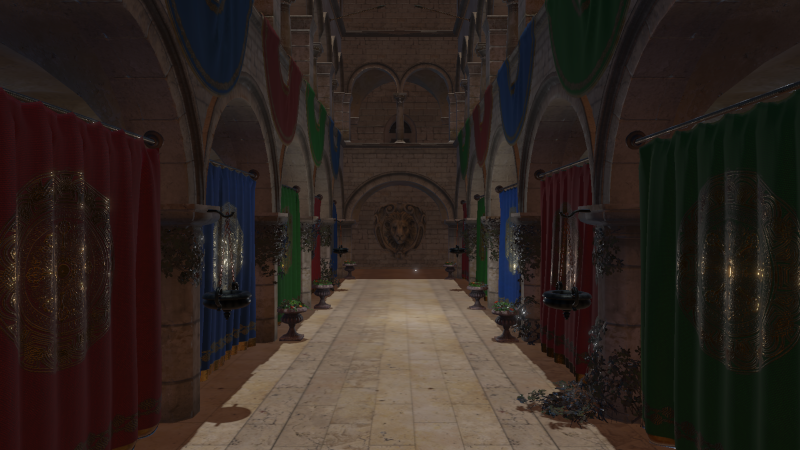
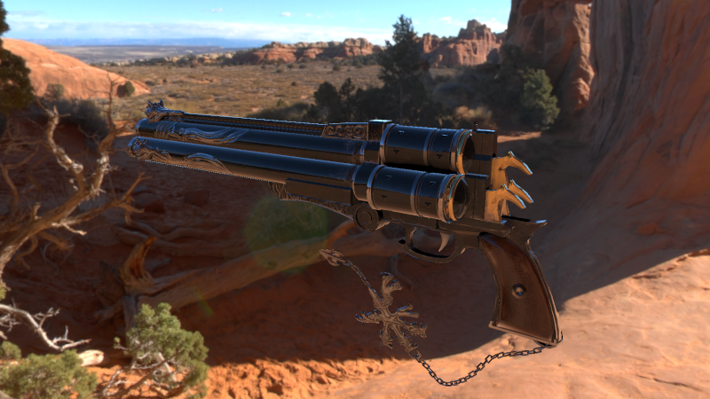
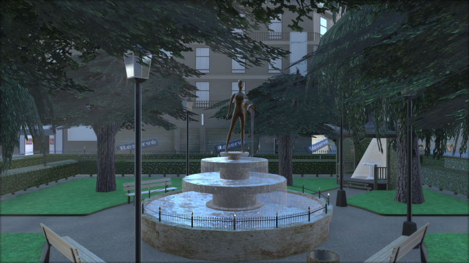
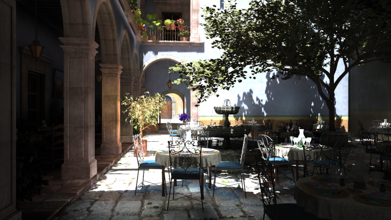

# Castor3D

Castor3D is a 3D engine written in C++ 17.
It works on Windows and GNU/Linux.
It relies on Ashes as a rendering API, allowing Vulkan, Direct3D 11, and OpenGL.
The project itself is compilable on supported platforms using CMake (\ref build).

## Features

- Deferred rendering for opaque objects.
- Blended Weighted rendering for transparent objects.
- Normal mapping.
- Shadow Mapping (allowing to choose between Raw, PCF or Variance Shadow Maps).
- Parallax Occlusion mapping.
- Screen Space Ambient Occlusion (using Scalable Ambiant Obscurance implementation).
- Reflection/Refraction Mapping.
- PBR rendering (Metallic and Specular workflows), and Phong rendering.
- HDR rendering with various tone mapping operators.
- Screen Space Subsurface Scattering (without backlit transmittance yet).
- Volumetric Light Scattering for the directional light source, if it projects shadows.
- Cascaded Shadow Maps for the directional light source.
- Global Illumination, through Light Propagation Volumes or Voxel Cone Tracing.
- Frustum culling.
- Scene graph.
- Modular architecture through plug-ins.
- Shaders are generated automatically from pipeline configuration.
- Shaders are writable directly from C++ code.
- Scenes are described using a text format easily comprehensible and extensible.
- Asynchronous (timers) or synchronour (thread) rendering.

## Implemented Plug-ins

### Importers
- ASSIMP: Multiple format mesh importer.
- PLY: Stanford Polygon library mesh importer.
- OBJ: Wavefront OBJ mesh importer.

### Dividers
- Loop subdivision surfaces.
- Phong tessellation.
- PN-Triangles surfaces.

### PostEffects
- Bloom: HDR Bloom implementation.
- FilmGrain: To display some grain on the render.
- GrayScale.
- LightStreaks (using Kawase Light Streaks).
- FXAA Antialiasing.
- SMAA Antialiasing (1X and T2X so far).
- Linear Motion Blur.

### Generators
- DiamondSquareTerrain: to generate terrains inside Castor3D scenes, using diamond-quare algorithm.

### Generic
- CastorGUI: to build GUIs inside Castor3D scenes.

### ToneMappings
- LinearToneMapping: Default tone mapping.
- HaarmPieterDuikerToneMapping: Haarm Pieter Duiker tone mapping.
- HejlBurgessDawsonToneMapping: Hejl Burgess Dawson tone mapping.
- ReinhardToneMapping: Reinhard tone mapping.
- Uncharted2ToneMapping: Uncharted 2 tone mapping.

## Links

- [Building Castor3D](https://dragonjoker.github.io/Castor3D/pages/build)
- [API Documentation](https://dragonjoker.github.io/Castor3D/doc)
- [Playlist on YouTube](https://www.youtube.com/playlist?list=PLKA1SVXuAbMNaFbSJyAN_4yD2bzNlgES3)

## Older Versions

- [v0.10.0](https://dragonjoker.github.io/Castor3D/v0.10.0/)
- [v0.9.0](https://dragonjoker.github.io/Castor3D/v0.9.0/)
- [v0.8.0](https://dragonjoker.github.io/Castor3D/v0.8.0/)
- [v0.7.0](https://dragonjoker.github.io/Castor3D/v0.7.0/)
