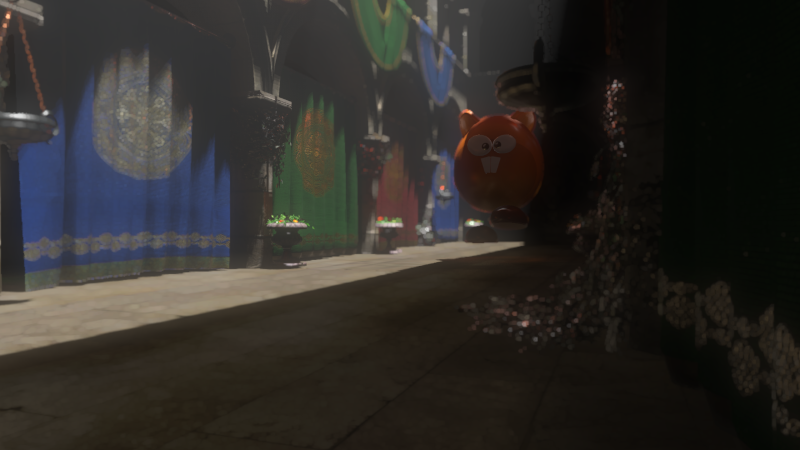
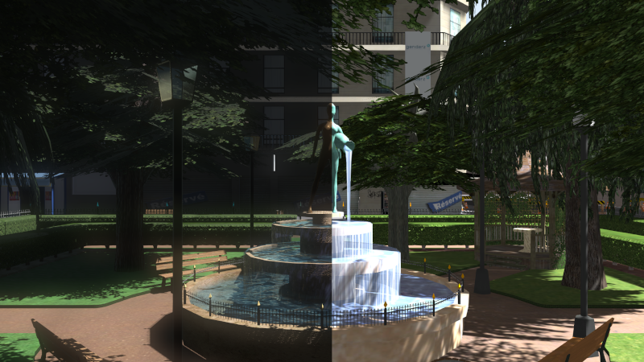
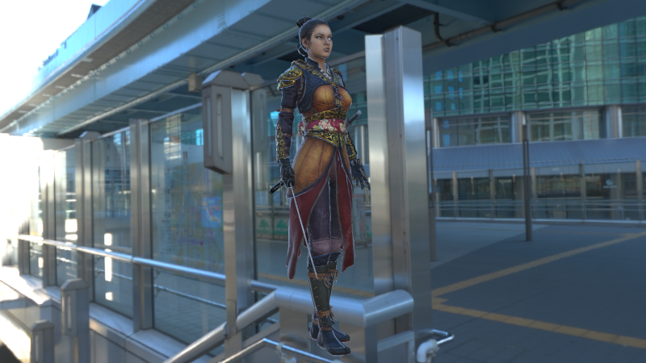
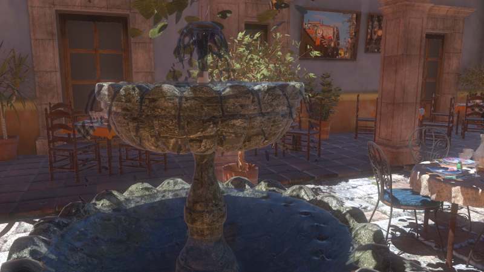
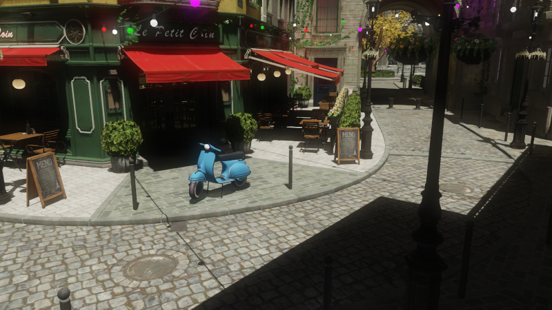
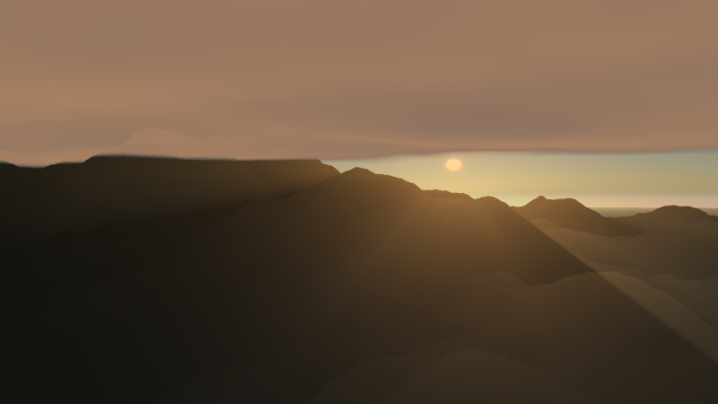
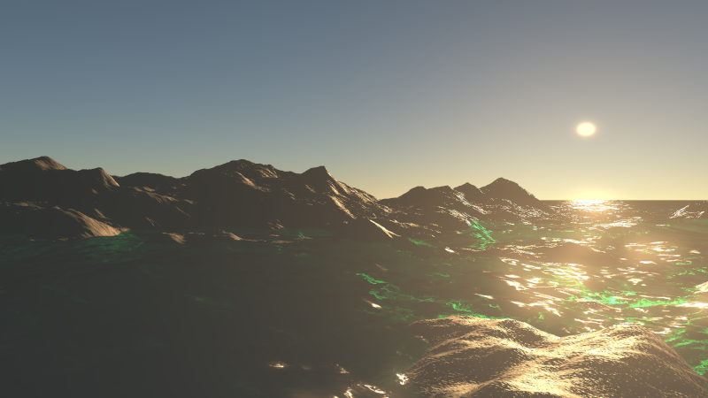

# Castor3D

Castor3D is a 3D engine written in C++ 20.
It works on Windows and GNU/Linux and using Vulkan as rendering API.
The project itself is compilable on supported platforms using CMake and vcpkg (\ref build).

## Features

- Deferred rendering for opaque objects.
- Blended Weighted rendering for transparent objects.
- Normal mapping.
- Shadow Mapping (allowing to choose between Raw, PCF or Variance Shadow Maps).
- Parallax Occlusion mapping.
- Screen Space Ambient Occlusion (using [Scalable Ambiant Obscurance](https://casual-effects.com/research/McGuire2012SAO/index.html)).
- Reflection/Refraction Mapping.
- PBR rendering (Metallic and Specular workflows), and Phong/Blinn-Phong rendering.
- HDR rendering with various tone mapping operators.
- Screen Space Subsurface Scattering (without backlit transmittance yet).
- Volumetric Light Scattering for the directional light source, if it projects shadows.
- Cascaded Shadow Maps for the directional light source.
- Global Illumination, through Light Propagation Volumes (layered or non layered, with or without geometry injection), or through Voxel Cone Tracing.
- Frustum culling.
- Scene graph.
- Render graph.
- Modular architecture through plug-ins.
- Shaders are generated automatically from pipeline configuration.
- Shaders are writable directly from C++ code.
- Scenes are described using a text format easily comprehensible and extensible.
- Synchronous (user defined) or asynchronous (thread) rendering.
- Using Mesh and Task shaders, if available.
- GUI primitives.

## Implemented Plug-ins

### Importers
- ASSIMP: Multiple format mesh importer.

### PostEffects
- Bloom: HDR Bloom implementation.
- PbrBloom : PBR Bloom implementation.
- DrawEdges: Detects and renders edges, based on normal, depth, and or object ID.
- FilmGrain: To display some grain on the render.
- GrayScale.
- LightStreaks (using Kawase Light Streaks).
- FXAA Antialiasing.
- SMAA Antialiasing (1X and T2X so far).
- Linear Motion Blur.

### Generators
- DiamondSquareTerrain: to generate terrains inside Castor3D scenes, using diamond-quare algorithm.

### Generic
- ToonMaterial: A toon material (to be combined with DrawEdges plugin).
- FFTOceanRendering: Ocean rendering using FFT generated surfaces.
- OceanRendering: Basic ocean rendering, specifying waves attributes.
- WaterRendering: Plane water surfaces rendering, using normal maps.
- AtmosphereScattering : Sky and atmosphere rendering (using [Scalable and Production Ready Sky and Atmosphere Rendering Technique](https://sebh.github.io/publications/egsr2020.pdf)).

### ToneMappings
- LinearToneMapping: Default tone mapping.
- HaarmPieterDuikerToneMapping: Haarm Pieter Duiker tone mapping.
- HejlBurgessDawsonToneMapping: Hejl Burgess Dawson tone mapping.
- ReinhardToneMapping: Reinhard tone mapping.
- Uncharted2ToneMapping: Uncharted 2 tone mapping.
- ACES: ACES tone mapping.

## Other applications

- CastorViewer: A scene viewer based on Castor3D.
- CastorMeshConverter: A converter from various mesh files to Castor3D mesh format.
- CastorMeshUpgrader: Upgrades from earlier versions of Castor3D mesh format to the latest one.
- HeightMapToNormalMap: Converts height maps to normal maps.
- ImgConverter: Allows you to convert any image file type to XPM or ICO.

## Links

- [Building Castor3D](https://dragonjoker.github.io/Castor3D/pages/build)
- [API Documentation](https://dragonjoker.github.io/Castor3D/doc)
- [Playlist on YouTube](https://www.youtube.com/playlist?list=PLKA1SVXuAbMNaFbSJyAN_4yD2bzNlgES3)

## Screenshots

## Older Versions

- [v0.14.0](https://dragonjoker.github.io/Castor3D/v0.14.0/)
- [v0.13.0](https://dragonjoker.github.io/Castor3D/v0.13.0/)
- [v0.12.0](https://dragonjoker.github.io/Castor3D/v0.12.0/)
- [v0.11.0](https://dragonjoker.github.io/Castor3D/v0.11.0/)
- [v0.10.0](https://dragonjoker.github.io/Castor3D/v0.10.0/)
- [v0.9.0](https://dragonjoker.github.io/Castor3D/v0.9.0/)
- [v0.8.0](https://dragonjoker.github.io/Castor3D/v0.8.0/)
- [v0.7.0](https://dragonjoker.github.io/Castor3D/v0.7.0/)
