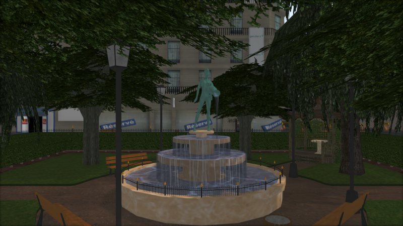

Castor3D
========

Castor3D is a 3D engine written in C++.
It works on Windows and also on GNU/Linux.
It is still a work in progress, feel free to contribute!

Features
--------

- Deferred rendering.
- Normal mapping.
- Parallax Occlusion mapping.
- Screen Space Ambient Occlusion (using Scalable Ambiant Obscurance implementation).
- Shadow Mapping (allowing to choose between Raw, PCF or Variance Shadow Maps).
- Reflection/Refraction Mapping.
- PBR rendering (Metallic and Specular workflows), and Legacy rendering.
- HDR rendering with various tone mapping operators.
- Screen Space Subsurface Scattering (without backlit transmittance yet).
- Volumetric Light Scattering for directional light source projecting shadows.
- Scene graph.
- Modular architecture through plug-ins.
- Shaders are generated automatically from material and pass configuration.
- Shaders are writable directly from C++ code.

Implemented Plug-ins
--------------------

**Renderers**
- GlRenderSystem.

**Importers**
- ASSIMP: Multiple format mesh importer.
- PLY: Stanford Polygon library mesh importer.
- OBJ: Wavefront OBJ mesh importer.

**Dividers**
- Loop subdivision surfaces.
- Phong tessellation.
- PN-Triangles surfaces.

**PostEffects**
- Bloom: HDR Bloom implementation.
- FilmGrain: To display some grain on the render.
- GrayScale.
- LightStreaks (using Kawase Light Streaks).
- FXAA Antialiasing.
- SMAA Antialiasing (1X and T2X so far).

**Generators**
- DiamondSquareTerrain: to generate terrains inside Castor3D scenes, using diamond-quare algorithm.

**Generic**
- CastorGUI: to build GUIs inside Castor3D scenes.

**ToneMappings**
- LinearToneMapping: Default tone mapping.
- HaarmPieterDuikerToneMapping: Haarm Pieter Duiker tone mapping.
- HejlBurgessDawsonToneMapping: Hejl Burgess Dawson tone mapping.
- ReinhardToneMapping: Reinhard tone mapping.
- Uncharted2ToneMapping: Uncharted 2 tone mapping.

Links
-----

- [Building Castor3D](https://dragonjoker.github.com/Castor3D/pages/build)
- [API Documentation](https://dragonjoker.github.com/Castor3D/doc)
- [Playlist on YouTube](https://www.youtube.com/playlist?list=PLKA1SVXuAbMNaFbSJyAN_4yD2bzNlgES3)

Older Versions
--------------

- [v0.9.0](https://dragonjoker.github.com/Castor3D/v0.9.0/)
- [v0.8.0](https://dragonjoker.github.com/Castor3D/v0.8.0/)
- [v0.7.0](https://dragonjoker.github.com/Castor3D/v0.7.0/)
